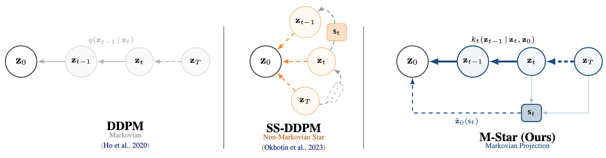

# Markovian-Projected Star-Shaped Diffusion (M-Star)

This repository contains the official JAX and PyTorch implementation for the paper **"Markovian Projection of Star-Shaped Diffusion for Exponential Family Distributions"**.

M-Star is a novel diffusion framework that combines the flexibility of star-shaped forward processes with the stability of traditional DDPMs. By learning a Markovian projection of star-shaped diffusion, M-Star enables generative modeling with a broad class of exponential family distributions while maintaining temporal coherence in the reverse process.

<p align="center">
  
</p>

## Abstract

Diffusion models achieve state-of-the-art performance in generative modeling but are limited by their reliance on Gaussian noise and the high computational cost of iterative sampling. Star-shaped diffusion addresses the former by introducing a non-Markovian forward process, yet this comes at the expense of temporal coherence in the reverse process. We propose a novel framework that resolves this trade-off by learning a Markovian projection of a star-shaped forward process, and its reversal. This design enables learning over a broad class of exponential models and recovers DDPM as a special case. It is particularly well-suited for knowledge distillation, allowing few-step or even single-step generation. Experiments demonstrate the effectiveness and flexibility of our approach across multiple generative tasks.

## Key Features

- **Flexible Distribution Support**: Works with any exponential family distribution (Gaussian, Beta, von Mises-Fisher, Dirichlet, Wishart, and more)
- **Temporal Coherence**: Maintains stable sampling trajectories through Markovian projection
- **Distillation-Ready**: Naturally suited for progressive distillation to few-step or one-step generation
- **DDPM Recovery**: Recovers standard Gaussian DDPM as a special case
- **State-of-the-Art Performance**: Competitive results on ImageNet, CIFAR-10, CIFAR-100, and MNIST
- **Geodesic Data Support**: Handles constrained manifolds and directional statistics


## Table of Contents

- [Installation](#installation)
- [Quick Start](#quick-start)
- [Model Architecture](#model-architecture)
- [Training](#training)
- [Sampling](#sampling)
- [Progressive Distillation](#progressive-distillation)
- [Supported Distributions](#supported-distributions)
- [Experiments](#experiments)
- [Results](#results)
- [Repository Structure](#repository-structure)
- [Citation](#citation)
- [License](#license)

## Installation

### Requirements

This repository is tested with:
- Python 3.8+
- PyTorch 2.0.0+
- CUDA 11.8+ (for GPU support)

### Setup

```bash
# Clone the repository
git clone https://github.com/your-org/mstar-diffusion
cd mstar-diffusion

# Create a virtual environment
python -m venv venv
source venv/bin/activate  # On Windows: venv\Scripts\activate

# Install dependencies
pip install -r requirements.txt

# Optional: Install from source
pip install -e .
```

### Dataset Preparation

Download and prepare datasets:

```bash
# Download datasets (CIFAR-10, CIFAR-100, ImageNet)
python scripts/download_datasets.py --dataset all

# Prepare FID statistics for evaluation
python scripts/prepare_fid_stats.py --dataset cifar10 --split train
```

## Quick Start

### Training a Gaussian M-Star Model on CIFAR-10

```bash
# Train base model (1024 steps)
python train.py \
  --dataset cifar10 \
  --distribution gaussian \
  --num_steps 1024 \
  --batch_size 128 \
  --epochs 1000 \
  --save_dir checkpoints/cifar10_gaussian
```

### Training a Beta M-Star Model on CIFAR-10

```bash
# Train Beta distribution model
python train.py \
  --dataset cifar10 \
  --distribution beta \
  --num_steps 1024 \
  --batch_size 128 \
  --epochs 1000 \
  --save_dir checkpoints/cifar10_beta
```

### Sampling from a Trained Model

```bash
# Generate samples
python sample.py \
  --checkpoint checkpoints/cifar10_gaussian/model_final.pt \
  --num_samples 50000 \
  --num_steps 1024 \
  --save_dir results/cifar10_samples

# Evaluate with FID
python -m pytorch_fid results/cifar10_samples datasets/cifar10_train_stats
```

### Progressive Distillation (1024 → 8 steps)

```bash
# Distill to 512 steps
python distill.py \
  --teacher checkpoints/cifar10_gaussian/model_final.pt \
  --num_steps 512 \
  --save_dir checkpoints/cifar10_distill_512

# Distill to 256 steps
python distill.py \
  --teacher checkpoints/cifar10_distill_512/model_final.pt \
  --num_steps 256 \
  --save_dir checkpoints/cifar10_distill_256

# Continue until 8 steps...
```

## Model Architecture

### Core Components

M-Star consists of three main components:

1. **Star-Shaped Forward Process**: Defines marginal distributions \(q(z_t | z_0)\) for each timestep
2. **Markovian Projection**: Constructs kernel \(k_t(z_t | z_{t-1}, z_0)\) that preserves marginals
3. **Neural Network Predictor**: Learns to predict clean data \(z_0\) from sufficient tail statistic \(\mathsf{s}_t\)

### Network Architecture

We use the NCSN++ architecture (similar to ADM) with the following configuration:

- **Backbone**: U-Net with attention
- **Channel multipliers**: [1, 2, 3, 4]
- **Attention resolutions**: [16, 8]
- **Dropout**: 0.1
- **Number of residual blocks**: 2 per resolution
- **Embedding**: Sinusoidal positional embedding for timesteps

### Sufficient Tail Statistic

The sufficient tail statistic is computed as:

```
s_t = Σ(k=t to T) A_k^T ψ(z_k)
```

where:
- `A_k`: Time-dependent matrix from linear parameterization
- `ψ(z_k)`: Sufficient statistic of the distribution (e.g., `z_k` for Gaussian)

## Training

### Basic Training

```bash
python train.py \
  --config configs/cifar10_gaussian.yaml \
  --gpu 0,1,2,3 \
  --wandb_project mstar-experiments
```

### Configuration Files

Example configuration (`configs/cifar10_gaussian.yaml`):

```yaml
# Model configuration
model:
  distribution: gaussian
  num_steps: 1024
  embedding_dim: 256
  hidden_dims: [256, 512, 512, 256]
  
# Noise schedule
schedule:
  type: cosine  # or linear, quadratic
  beta_start: 0.0001
  beta_end: 0.02

# Training
training:
  batch_size: 128
  epochs: 1000
  learning_rate: 2e-4
  optimizer: adam
  ema_decay: 0.9999
  gradient_clip: 1.0
  
# Loss
loss:
  type: mse  # mean squared error
  weight_schedule: snr  # Signal-to-noise ratio weighting

# Data
data:
  dataset: cifar10
  image_size: 32
  num_workers: 8
  augmentation: true
```

### Multi-GPU Training

```bash
# DDP training on 4 GPUs
torchrun --nproc_per_node=4 train.py \
  --config configs/imagenet64.yaml \
  --distributed
```

### Monitoring Training

Training metrics are logged to Weights & Biases by default:

```python
# Key metrics tracked:
# - Loss (MSE between z_0 and predicted z_0)
# - M_t convergence error (for Gaussian case)
# - Sample quality (FID, IS)
# - Learning rate schedule
# - Gradient norms
```

## Sampling

### Standard Sampling Algorithm

```python
from mstar import MStar, GaussianDistribution

# Load model
model = MStar.from_pretrained('checkpoints/cifar10_gaussian/model_final.pt')

# Generate samples
samples = model.sample(
    num_samples=64,
    num_steps=1024,
    device='cuda'
)
```

### Sampling with Different Distributions

```python
# von Mises-Fisher for spherical data
from mstar.distributions import VonMisesFisher

model = MStar(
    distribution=VonMisesFisher(dim=3),
    num_steps=1024
)

# Sample directional data
directions = model.sample(num_samples=1000)
```

### Accelerated Sampling

```python
# Few-step sampling with distilled model
distilled_model = MStar.from_pretrained('checkpoints/cifar10_distill_8/model_final.pt')

samples = distilled_model.sample(
    num_samples=50000,
    num_steps=8,  # Only 8 function evaluations!
    device='cuda'
)
```

## Progressive Distillation

Progressive distillation compresses the model from T steps to T/2, T/4, etc.

### Distillation Process

```python
from mstar.distillation import ProgressiveDistillation

# Initialize distillation
distiller = ProgressiveDistillation(
    teacher_checkpoint='checkpoints/teacher_1024.pt',
    student_num_steps=512,
    learning_rate=1e-4,
    batch_size=256
)

# Run distillation
distiller.train(
    num_epochs=50,
    save_dir='checkpoints/student_512'
)
```

### Multi-Stage Distillation

```bash
# Automated distillation pipeline
python scripts/progressive_distill.py \
  --teacher checkpoints/base_1024.pt \
  --target_steps 8 \
  --stages 512,256,128,64,32,16,8 \
  --output_dir checkpoints/distilled
```

### Distillation Loss

The distillation objective is:

```
L_distill(φ) = E_t[E_s_t[||z_φ(s_t, t) - z_θ(s_{t-1}, t-1)||^2]]
```

where:
- `z_φ`: Student model prediction
- `z_θ`: Teacher model prediction (frozen)
- `s_t`: Sufficient tail statistic

## Supported Distributions

M-Star supports any exponential family distribution satisfying the linear parameterization assumption:

### Currently Implemented

| Distribution | Manifold | Use Case | Status |
|-------------|----------|----------|--------|
| **Gaussian** | ℝ^d | Images, general data | ✅ Fully supported |
| **Beta** | [0,1]^d | Constrained data | ✅ Fully supported |
| **von Mises-Fisher** | S^{d-1} | Directional/spherical data | ✅ Fully supported |
| **Dirichlet** | Probability simplex | Compositional data | ✅ Fully supported |
| **Wishart** | Positive definite matrices | Covariance matrices | ✅ Fully supported |
| **Categorical** | Discrete space | Text, discrete tokens | 🚧 In progress |

### Adding Custom Distributions

To add a new distribution:

```python
from mstar.distributions import ExponentialFamilyDistribution

class MyDistribution(ExponentialFamilyDistribution):
    def sufficient_statistic(self, z):
        """Return ψ(z)"""
        return z  # Example: identity
    
    def natural_parameter(self, z0, t):
        """Return η_t(z0) = A_t f(z0) + b_t"""
        return self.A_t @ self.feature_map(z0) + self.b_t
    
    def log_partition(self, eta):
        """Return log-partition function a(η)"""
        # Implement based on your distribution
        pass
    
    def sample(self, eta):
        """Sample from the distribution with natural parameter η"""
        # Implement sampling
        pass
```

## Experiments

### ImageNet Experiments

```bash
# ImageNet 64×64
python train.py --config configs/imagenet64.yaml --gpu 0,1,2,3,4,5,6,7

# ImageNet 128×128
python train.py --config configs/imagenet128.yaml --gpu 0,1,2,3,4,5,6,7
```

### CIFAR Experiments

```bash
# CIFAR-10 with Gaussian
python train.py --config configs/cifar10_gaussian.yaml

# CIFAR-10 with Beta distribution
python train.py --config configs/cifar10_beta.yaml

# CIFAR-100
python train.py --config configs/cifar100.yaml
```

### Anomaly Detection

```bash
# Train on MNIST for anomaly detection
python experiments/anomaly_detection.py \
  --dataset mnist \
  --normal_class 1 \
  --config configs/mnist_anomaly.yaml
```

### Geodesic Data (von Mises-Fisher)

```bash
# Train on fire dataset (spherical coordinates)
python experiments/geodesic.py \
  --dataset fire \
  --distribution vmf \
  --config configs/geodesic_vmf.yaml
```

## Results

### ImageNet 64×64

| Method | Steps | FID ↓ | IS ↑ |
|--------|-------|-------|------|
| VDM++ | 1024 | 1.43 | 64 |
| Our Teacher | 1024 | 1.42 | 84 |
| PD | 8 | 1.70 | 63 |
| **M-Star (Ours)** | **8** | **1.24** | **78** |

### ImageNet 128×128

| Method | Steps | FID ↓ | IS ↑ |
|--------|-------|-------|------|
| Our Teacher | 1024 | 1.76 | 194 |
| PD | 8 | 2.50 | 162 |
| **M-Star (Ours)** | **8** | **1.49** | **184** |

### CIFAR-10 Anomaly Detection (AUPRC)

| Method | Digit 1 | Digit 4 | Digit 5 |
|--------|---------|---------|---------|
| VAE | 0.072 | 0.345 | 0.332 |
| LEBM | 0.342 | 0.635 | 0.622 |
| **M-Star** | **0.690** | **0.918** | **0.942** |

### Generated Samples

<p align="center">
  
</p>

*ImageNet 128×128 samples from 8-step distilled M-Star model*

## Repository Structure

```
mstar-diffusion/
├── mstar/                      # Main package
│   ├── models/                 # Model implementations
│   │   ├── unet.py            # U-Net backbone
│   │   ├── mstar.py           # M-Star core model
│   │   └── networks.py        # Network utilities
│   ├── distributions/         # Exponential family distributions
│   │   ├── gaussian.py
│   │   ├── beta.py
│   │   ├── vmf.py
│   │   ├── dirichlet.py
│   │   └── wishart.py
│   ├── schedulers/            # Noise schedules
│   │   ├── linear.py
│   │   ├── cosine.py
│   │   └── snr_matching.py
│   ├── distillation/          # Progressive distillation
│   │   └── progressive.py
│   └── utils/                 # Utilities
│       ├── metrics.py
│       └── visualization.py
├── configs/                   # Configuration files
│   ├── cifar10_gaussian.yaml
│   ├── cifar10_beta.yaml
│   ├── imagenet64.yaml
│   └── geodesic_vmf.yaml
├── experiments/              # Experiment scripts
│   ├── anomaly_detection.py
│   ├── geodesic.py
│   └── ablations.py
├── scripts/                  # Utility scripts
│   ├── download_datasets.py
│   ├── prepare_fid_stats.py
│   └── progressive_distill.py
├── train.py                  # Main training script
├── sample.py                 # Sampling script
├── distill.py               # Distillation script
├── evaluate.py              # Evaluation script
├── requirements.txt
└── README.md
```

## Advanced Usage

### Custom Noise Schedules

```python
from mstar.schedulers import NoiseSchedule

class CustomSchedule(NoiseSchedule):
    def get_betas(self, num_steps):
        # Define custom β_t schedule
        return custom_betas
    
    def snr(self, t):
        # Return signal-to-noise ratio at timestep t
        return custom_snr
```

### Interaction Matrix Learning

The interaction matrix M_t is learned automatically by minimizing:

```python
# Loss for learning M_t
loss_Mt = KL(q(z_{t-1} | z_t, z_0) || q(z_{t-1} | z_t, ẑ_0))
```

For Gaussian distributions, M_t converges to the theoretical value:

```python
M_t = sqrt(α_t) / β_t * I
```

### Visualization

```python
from mstar.utils.visualization import plot_trajectory

# Visualize sampling trajectory
trajectory = model.sample_trajectory(num_samples=1, return_all=True)
plot_trajectory(trajectory, save_path='results/trajectory.png')
```

## Performance Tips

1. **Use Mixed Precision Training**: Speeds up training by ~2x
   ```bash
   python train.py --config config.yaml --amp
   ```

2. **Gradient Accumulation**: For larger effective batch sizes
   ```bash
   python train.py --batch_size 64 --gradient_accumulation_steps 4
   ```

3. **Compile Model (PyTorch 2.0+)**: Further speed improvements
   ```python
   model = torch.compile(model)
   ```

4. **EMA for Better Samples**: Use exponential moving average of weights
   ```python
   # Already enabled by default with ema_decay=0.9999
   ```

## Troubleshooting

### Common Issues

**Issue**: Out of memory during training
```bash
# Solution: Reduce batch size or use gradient checkpointing
python train.py --batch_size 64 --gradient_checkpointing
```

**Issue**: M_t not converging (Gaussian case)
```bash
# Solution: Check noise schedule and increase learning rate for M_t
python train.py --config config.yaml --mt_lr 1e-3
```

**Issue**: Poor sample quality at low steps
```bash
# Solution: Ensure progressive distillation is done properly
# Start from a well-trained teacher and use small step reductions
```

## Citation

If you use this code or find our work helpful, please cite:

```bibtex
@inproceedings{anonymous,
  title={Markovian Projection of Star-Shaped Diffusion for Exponential Family Distributions},
  author={[Authors]},
  year={2026},
}
```

## Related Work

- **DDPM**: [Denoising Diffusion Probabilistic Models](https://arxiv.org/abs/2006.11239)
- **SS-DDPM**: [Star-Shaped Denoising Diffusion Probabilistic Models](https://arxiv.org/abs/2302.05259)
- **Progressive Distillation**: [Progressive Distillation for Fast Sampling](https://arxiv.org/abs/2202.00512)
- **Flow Matching**: [Flow Matching for Generative Modeling](https://arxiv.org/abs/2210.02747)

## License

This project is licensed under the MIT License - see the [LICENSE](LICENSE) file for details.

## Acknowledgments

We thank the authors of SS-DDPM for their initial foundational work on star-shaped diffusion processes. This work builds upon their insights to create a more practical and flexible framework.

---

**Note**: This is a research project. While we strive for correctness and reproducibility. Contributions and feedback are welcome!
